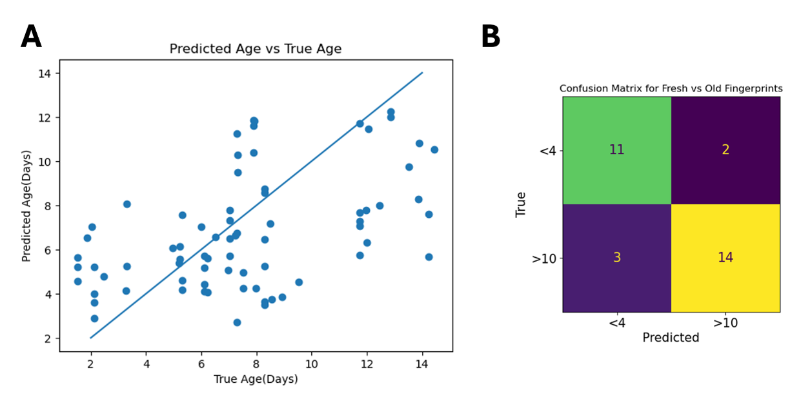

# FPAge
A novel method for dating forensically relevant developed fingerprints from a crime scene using DESI-MS.

This repository contains the official code for the paper:

**Age Determination of Latent Fingerprints Directly from Forensic Adhesive Tape Using Ultrafast Desorption Electrospray Ionization Mass Spectrometry and Machine Learning**

## Overview

The method presented in the paper utilizes ultrafast two-dimensional desorption electrospray ionization mass spectrometry (DESI-MS) for the age determination of latent fingerprints. Fingerprints are developed with magnetic powder, lifted using adhesive tape, and analyzed directly from the tape. This approach enables rapid processing of fingerprints found on a wide variety of nonporous surfaces at crime scenes.


*Workflow of fingerprint collection and analysis using DESI-MS.*

### Key Highlights
- Collection of 750 fingerprints from 330 volunteers.
- XGBoost algorithm used for age prediction, achieving a correlation of 0.5 for fingerprint age and an accuracy of 83.3% in distinguishing between fresh (0-4 days) and older (10-15 days) fingerprints.
- DESI-MS imaging performed directly on the adhesive tape, which speeds up forensic workflows.
- Collaboration between police forensic divisions and academic institutions ensures practical application.



*XGBoost model predictions for fingerprint age. Confusion matrix for fresh vs. old fingerprints.*


*Molecular ions detected from magnetic powder-developed fingerprints imaged directly from forensic adhesive tape.*

## Getting Started

### Prerequisites

This project uses `conda` to manage dependencies. Make sure you have `conda` installed. Follow these instructions to set up the environment.

### Conda Environment Setup

1. Create a new conda environment:
    ```bash
    conda create -n fpage
    ```

2. Activate the environment:
    ```bash
    conda activate fpage
    ```

3. Install the required dependencies:
    ```bash
    conda install matplotlib seaborn pandas pyarrow numpy openpyxl scikit-learn xgboost scipy jupyter
    ```

4. Clone the repository and add the `data` folder.

    After adding the `data` folder, the notebooks should run seamlessly with the appropriate conda environment.

### Data Access

Requests for the data can be sent to [fpagedata@gmail.com](mailto:fpagedata@gmail.com). Please note:
- Only requests from official academic email addresses will be responded to.
- If you are a commercial entity, use `[Commercial]` in the subject line of your email.

### Citation

Please cite this work using the following format or any other acceptable format of the paper:

**Rajs, N., Harush-Brosh, Y., Raisch, R., Yakobi, R., Zoabi, A., Nevet Golan, G., Shpitzen, M., Wiesner, S. S., Levin-Elad, M., & Margulis, K. (2024).**  
_Age Determination of Latent Fingerprints Directly from Forensic Adhesive Tape Using Ultrafast Desorption Electrospray Ionization Mass Spectrometry and Machine Learning._  
Division of Identification and Forensic Science, Israel Police, & The Hebrew University of Jerusalem.

### Contact

For any questions, clarifications, or special requests regarding the code, feel free to send an email to [fpagedata@gmail.com](mailto:fpagedata@gmail.com) with `[CODE]` in the subject line. We are happy to assist you.

## Paper Summary

This study pioneers the use of **DESI-MS** for dating latent fingerprints. By combining mass spectrometry with machine learning, the study effectively addresses the challenge of determining the age of fingerprints found at crime scenes. DESI-MS is a valuable tool for forensic scientists, offering the potential for rapid, on-site fingerprint analysis.


*Comparison between fresh and aged fingerprint patterns visualized by DESI-MS in both positive and negative ionization modes.*

### Abstract

Fingerprints provide crucial forensic evidence for identifying suspects. While matching fingerprints to databases is routine, determining the time since deposition (age) of a fingerprint remains a challenge. This study introduces a novel method using **DESI-MS** to analyze fingerprints directly from adhesive tape after development with magnetic powder. The research covers 750 fingerprints from 330 volunteers aged up to 15 days, achieving a prediction accuracy of 83.3% for age classification (fresh vs. aged prints). 

### Methodology

The study utilizes **DESI-MS** to obtain chemical profiles of developed fingerprints, which are then processed using machine learning models such as **XGBoost**. A synthetic dataset was generated using the **SMOTE** algorithm, increasing the robustness of the age predictions.


*Illustration of the SMOTE algorithm used to generate synthetic fingerprints for machine learning training.*

Key optimization steps:
- DESI-MS scan rate: 1700 µm/sec
- Pixel size: 150 µm
- m/z range: 100-700 for positive ion mode
- Final scan time per fingerprint: 2.5 minutes

### Results

Using this approach, fingerprints were successfully classified as either fresh (0-4 days) or aged (10-15 days) with **83.3% accuracy**. The technique allows for rapid and reliable dating of fingerprints, filling a crucial gap in forensic science.

## References

For more information and to access the full manuscript, refer to the paper:  
[Rajs, N., Harush-Brosh, Y., Raisch, R., et al. Age Determination of Latent Fingerprints... (2024)].
